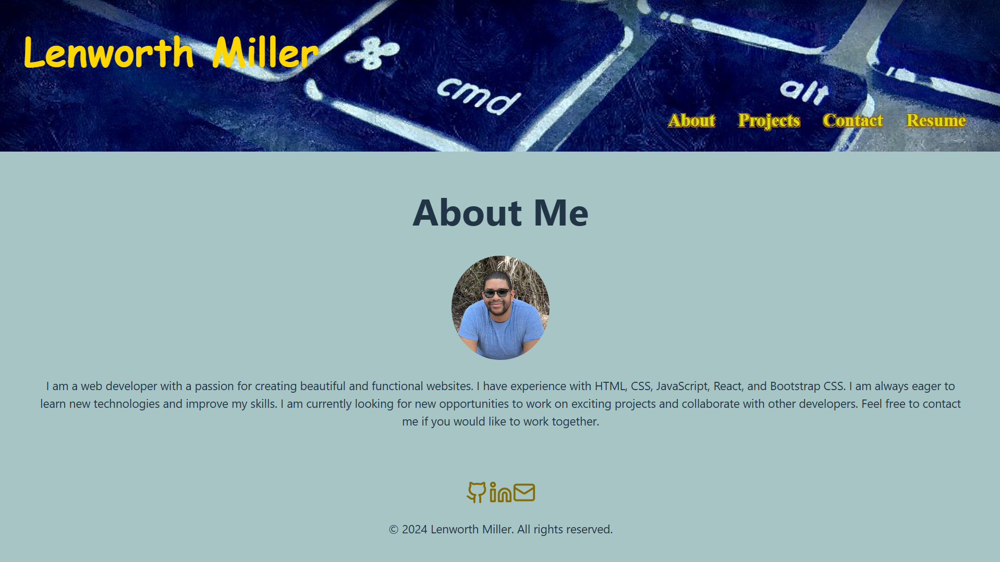
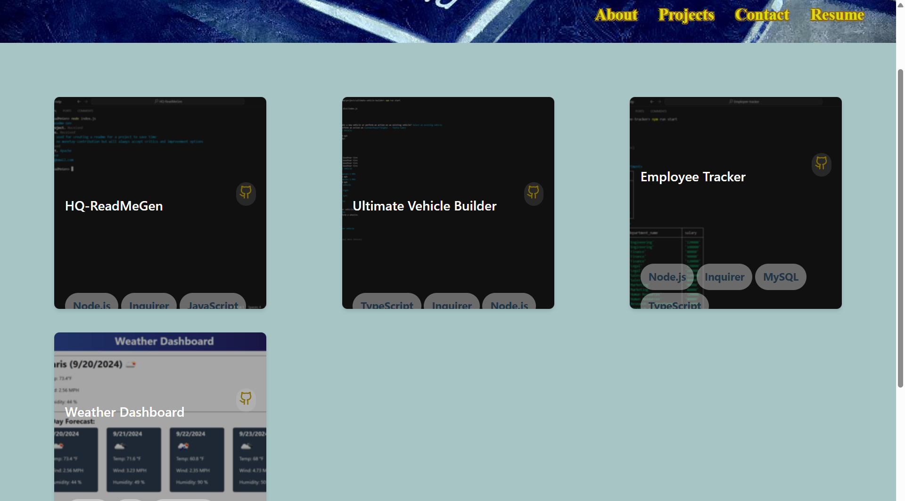
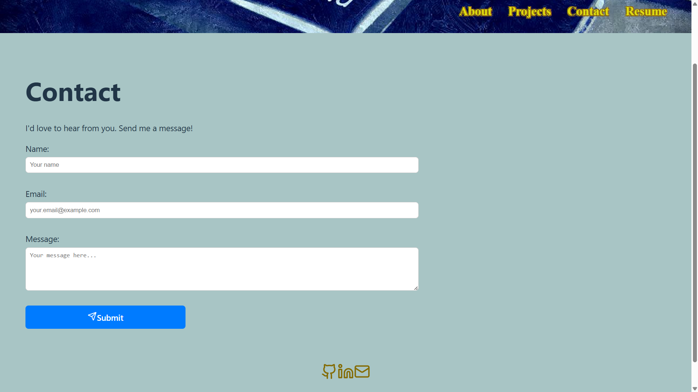
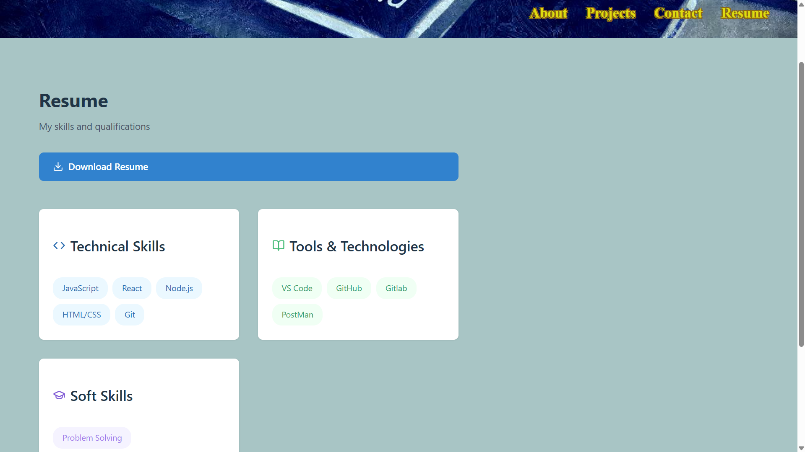

# Lenworth-Portfolio

## Basic Overview
This website servers as a creation of a portfolio using my new React skills. By being a web developer means that I am apart of a community. I would need a place not only to share my projects while i am applying for jobs or working as a freelancer but also to share my work with other developers and collaborate on projects.

## The Application

The application was deployed on Netlify.com to host the website. The website was created using the following tools: 

    React
    type: Javascript

The website  has four (4) pages:
    About Me
    Projects: Github Projects and links to them
    Contact me
    Resume: with downloadable Resume.pdf

Each page has a single `Header` component, a single `Navigation` component within the header, and a single `Footer` component. 

## Screenshot
The following images demonstrates the application's appearance:

About Me Page

Projects Page

Contact Page

Resume Page

© 2024 lenworth425 Confidential and Proprietary. All Rights Reserved.